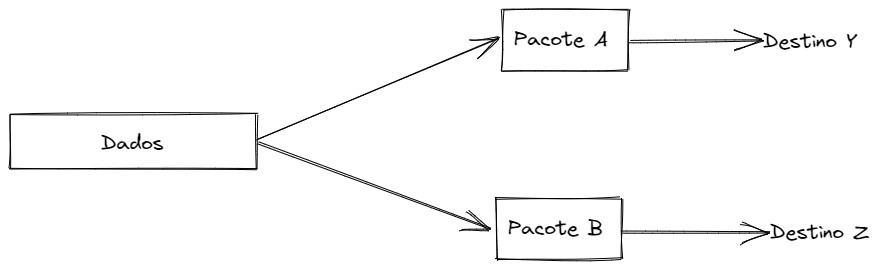
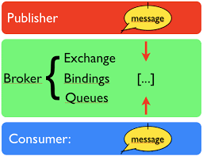

# RabbitMQ (Mensageria)

[RabbitMQ](https://pt.wikipedia.org/wiki/RabbitMQ) é um servidor para troca de informações entre informações de código-aberto desenvolvido em ErLang, sendo suportado utilizando o protocolo de troca de dados chamado AMQP. É capaz de escalar o processamento através do carregamento assíncrono das mensagens.

## Protocolo AMQP

AQMP é sigla para definição de Protocolo avançado de enfileiramento de mensagens um protocolo de rede para comunicação entre dois componentes de software de modo assíncrono, em que um software pode receber ou enviar mensagens a qualquer momento, de modo a tomar uma resposta com a chegada da informação.

Com esse protocolo é possível que independente de qual linguagem utilizada para o desenvolvimento de uma aplicação ou qual tipo de sistema operacional utilizado para hospedar a aplicação, é possível que você mantenha dois projetos ou aplicações em comunicação. Sendo assim, pode-se dizer que o protocolo AMPQ é responsável por integrar API's/IoT/Web Applications entre outros.

### Origem

Sua origem se deu da necessidade da integração entre os diferentes tipos de sistemas sendo desenvolvido pelas empresas, como apontado no [artigo](https://learn.microsoft.com/pt-br/azure/service-bus-messaging/service-bus-amqp-overview), produtos de [middleware](https://www.redhat.com/pt-br/topics/middleware/what-is-middleware) usavam protocolos proprietários para comunicação entre o aplicativo e o cliente, o que causava uma certa dependência de serviço, já que os desenvolvedores que integrassem a esse serviço teriam que utilizar bibliotecas próprias desses middlewares.

Por outro lado, aplicações que necessitam da utilização de dois serviços de mensageria diferentes, requerem a realização de uma ponte no nível de aplicação, de modo que consiga converter para as mensagens proprietárias.

Conforme falado, passou a haver a necessidade de criação de um padrão para essas comunicações, criando uma interconexão direta entre os agentes de conexão utilizando o [Apache Qpid Dispatch Router](https://qpid.apache.org/components/dispatch-router/index.html).

#### Apache Qpid Dispatch Router

O Dispatch Router é um roteador de mensagens (seleção os caminhos nas quais os pacotes irão fazer desde sua origem até seu destino) AMQP, ou seja, realiza a determinação da "viagem" realizada pelos pacotes de mensagens.

## O que são protocolos de rede?

Protocolos de rede são normas que permitem a comunicação de dados/informações entre dois computadores/servidores. Sendo responsáveis por pegar os dados e dividir em pacotes, nas quais cada pacote possui um endereçamento de destino e origem.

## Estrutura

### Publisher

Entidade ou máquina que envia os dados para o servidor de enfileiramento de mensagens (broker).

### Broker

Servidor de filas, na qual implemente o protocolo AMQP, roteando até seus consumidores.

#### Exchange

Objeto responsável por aceitar e validar a mensagem, de modo a utilizar critérios expostos pelo binding.

#### Bindings

Objeto responsável por dizer como o ele deve encaminhar as mensagens, para qual fileira e destino, de modo a atender os critérios utilizados pelo cliente de origem.

#### Messages Queues

Objeto responsável por armazenar em memória ou disco e entregar em sequência para o destinátario final.

### Consumer

Aplicações/Programas/Projetos responsável por consumir as filas de mensagens.

# Fontes
- [Documentação Microsoft](https://learn.microsoft.com/pt-br/azure/service-bus-messaging/service-bus-amqp-overview)
- [Wikipédia - RabbitMQ](https://pt.wikipedia.org/wiki/RabbitMQ)
- [Conceito de Middleware](https://www.redhat.com/pt-br/topics/middleware/what-is-middleware)
- [Artigo NelsonSaar](http://nelsonsar.github.io/2013/10/29/AMQP-building-blocks.html)
- [Documentação RabbitMQ](https://www.rabbitmq.com/tutorials/amqp-concepts.html)